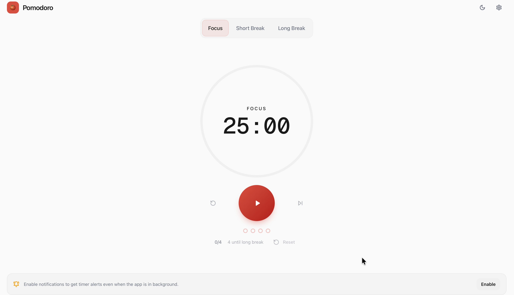

# 🍅 Pomodoro Focus

A clean, modern, and highly functional Pomodoro timer designed to help you stay focused and manage your productivity sessions effectively.



## ✨ Features

- **🎯 Smart Timer:** Seamlessly switch between Focus, Short Break, and Long Break sessions with per-mode progress preservation and background ticking.
- **🖐️ Gesture Navigation:** Intuitive swipe left/right gestures to switch between timer modes.
- **📊 Session Statistics:** Detailed daily summary with a convenient "Copy to Markdown" feature for productivity logging.
- **🎵 Mode-Specific Audio:** Distinct, pleasant audio patterns for each session type.
- **🔄 Session Tracking:** Visual indicators on tabs and a cycle tracker to monitor your progress.
- **🌗 Dark Mode:** Responsive theme toggle for comfortable use day or night.
- **📱 PWA Ready:** High-quality SVG icons and installable as a progressive web app for a native experience.
- **⚙️ Customization:** Adjust timer durations and automation settings with a quick "Reset to Defaults" option.

## 🛠️ Tech Stack

- **Framework:** [Next.js](https://nextjs.org/) (App Router)
- **Language:** [TypeScript](https://www.typescriptlang.org/)
- **Styling:** [Tailwind CSS](https://tailwindcss.com/)
- **UI Components:** [Shadcn UI](https://ui.shadcn.com/)
- **State Management:** [Zustand](https://github.com/pmndrs/zustand)
- **Database:** [Prisma](https://www.prisma.io/) with SQLite
- **Backend/Push:** [Firebase](https://firebase.google.com/)
- **Runtime:** [Bun](https://bun.sh/)

## 🚀 Getting Started

### Prerequisites

- [Bun](https://bun.sh/) installed on your machine.

### Installation

1.  **Clone the repository:**
    ```bash
    git clone https://github.com/CJ-1981/pomodoro-focus.git
    cd pomodoro-focus
    ```

2.  **Install dependencies:**
    ```bash
    bun install
    ```

3.  **Setup the database:**
    ```bash
    bun run db:push
    ```

4.  **Run the development server:**
    ```bash
    bun run dev
    ```

5.  Open [http://localhost:3000](http://localhost:3000) in your browser.

## 📦 Deployment

This project is configured for automated deployment to **GitHub Pages** via GitHub Actions.

Live Demo: [https://cj-1981.github.io/pomodoro-focus/](https://cj-1981.github.io/pomodoro-focus/)

## 📄 License

MIT

---
Made with ❤️ for productivity.
